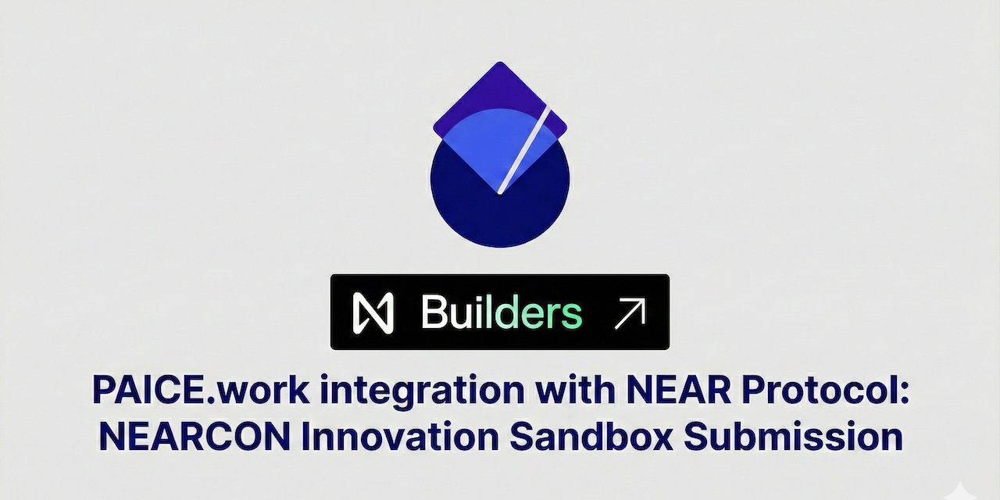

<p align="center">
  
</p>

# PAICE + NEAR Protocol Integration

**Privacy-preserving AI collaboration assessment with verifiable private inference and on-chain attestation via NEAR.**

PAICE.work is a production privacy-preserving AI assessment platform deployed at [PAICE.work](https://paice.work). This repository contains the NEAR Protocol integration layer, built for the [NEARCON Innovation Sandbox 2026](https://near-innovation-sandbox.devspot.app/). But this isn't just a testnet proof-of-concept, this is [running on mainnet](https://nearblocks.io/txns/3dG2Qr8KRgLedeZctz8TPe2KwRinWXPCzLkvX37yoRFY) and our development instance today, and should be running in production by [NEARCON](https://nearcon.org/).

## What This Does

### Layer 1: On-Chain Assessment Attestation
After each assessment, the score payload is SHA-256 hashed and written to a NEAR smart contract. Anyone can verify that assessment results haven't been tampered with by checking the on-chain hash.

### Layer 2: Private Inference via NEAR AI Cloud
All AI inference runs inside hardware-secured TEE (Trusted Execution Environment) enclaves via NEAR AI Cloud. Neither PAICE, NEAR, nor the cloud provider can see conversation content during processing.

### Layer 3: Three-Layer Model Cascade
PAICE separates concerns across three dedicated model layers, each running inside TEE enclaves:

| Layer | Primary Model | Fallback | Role |
|-------|--------------|----------|------|
| **Chat** | GPT OSS 120B | DeepSeek V3.1 | Conducts the assessment conversation |
| **Middleware** | Qwen3 30B | DeepSeek V3.1 | QA validation of AI responses |
| **Evaluation** | GLM 4.7 | GPT OSS 120B | Scores the conversation (0-1000 PAICE Score™ scale) |

All four models are TEE-protected ("Private" classification on NEAR AI Cloud). If a primary model fails, the cascade automatically falls back to the secondary model.

## Quick Start

### Try the Demos

All demos are self-contained HTML files — open in a browser and run the full pipeline. The cascade demo (`demo/cascade.html`) comes pre-configured with a demo API key so you can try it immediately.

| Demo | File | Network | Description |
|------|------|---------|-------------|
| **Cascade (testnet)** | `demo/cascade.html` | Testnet | Three-layer cascade with live testnet attestation. **[Start here.](https://snapsynapse.github.io/paice-near-integration/demo/cascade.html)** |
| **Cascade (mainnet)** | `demo/cascade-mainnet.html` | Mainnet | Same cascade, configured for `paice.near` mainnet contract. |
| **Single-model** | `demo/index.html` | Testnet | Simplified single-model version for reference. |

**7-step pipeline** (cascade demos):

1. Connect to NEAR AI Cloud
2. Chat via TEE-protected cascade (GPT OSS 120B)
3. Middleware QA validation (Qwen3 30B)
4. Generate assessment scores (GLM 4.7)
5. Hash score payload (SHA-256)
6. Sign and write attestation to NEAR smart contract (via `near-api-js`)
7. Verify the attestation on-chain

### Test the API

```bash
# Test NEAR AI Cloud inference
export NEAR_AI_API_KEY=sk-your-key
python integration/examples/test_near_ai.py

# Test attestation verification
python integration/examples/test_attestation.py
```

### Verify an Attestation

```python
from integration.near_service import AttestationService

# Testnet (demo)
service = AttestationService(
    contract_id="paice-demo.testnet",
    network="testnet"
)

# Mainnet (production)
# service = AttestationService(contract_id="paice.near", network="mainnet")

# Verify a session (session IDs follow the pattern "paice-{timestamp}-{random}")
result = service.verify("paice-1771107293691-8x2ra")
print(f"Found: {result.found}")
print(f"Score hash: {result.score_hash}")
print(f"Attester: {result.attester}")
```

## Repository Structure

```
paice-near-integration/
  src/
    lib.rs                       # Rust smart contract (NEAR SDK 5.6.0)
  Cargo.toml                     # Smart contract package config
  integration/
    near_service.py              # Python service (inference + attestation + cascade)
    near_config.py               # Configuration management
    examples/
      test_near_ai.py            # NEAR AI Cloud test script
      test_attestation.py        # Contract verification test
  demo/
    cascade.html                 # Three-layer cascade demo (testnet)
    cascade-mainnet.html         # Three-layer cascade demo (mainnet, paice.near)
    index.html                   # Single-model demo (reference)
  docs/
    architecture.md              # Integration architecture & cascade design
```

## Deployed Contracts

### Testnet (Hackathon Demo)

| Field | Value |
|-------|-------|
| Address | `paice-demo.testnet` |
| Network | NEAR Testnet |
| Explorer | [View on NearBlocks](https://testnet.nearblocks.io/address/paice-demo.testnet) |
| Methods | `attest()`, `verify()`, `get_attestation_count()` |
| Deployed via | NEAR CLI (`near-cli-rs`) |

### Mainnet (Production)

| Field | Value |
|-------|-------|
| Address | `paice.near` |
| Network | NEAR Mainnet |
| Explorer | [View on NearBlocks](https://nearblocks.io/address/paice.near) |
| Methods | `attest()`, `verify()`, `get_attestation_count()` |

The testnet contract is fully operational and used for the interactive demos. Attestation transactions are signed client-side via `near-api-js` (v4.0.4) with an embedded testnet keypair — testnet NEAR has zero monetary value, so key exposure is safe. The mainnet account `paice.near` is registered and funded, with the same contract deployed for production use within the PAICE platform at [PAICE.work](https://paice.work).

**Live demo:** [https://snapsynapse.github.io/paice-near-integration/](https://snapsynapse.github.io/paice-near-integration/) — hosted on GitHub Pages, API key pre-loaded, no setup required.

## NEAR AI Cloud Models Used

### TEE-Protected ("Private") Models

These models run inside hardware-secured TEE enclaves. Conversation data is inaccessible to NEAR, the cloud provider, or PAICE.work during processing.

| Model | Cascade Role | Cost (Input/Output per M tokens) | Latency |
|-------|:---:|-------|-------|
| GPT OSS 120B | Chat (primary) | $0.15 / $0.55 | ~1-3s |
| Qwen3 30B | Middleware (primary) | $0.15 / $0.55 | ~1-2s |
| GLM 4.7 | Evaluation (primary) | $0.85 / $3.30 | ~15-20s |
| DeepSeek V3.1 | Fallback (chat/middleware) | $1.05 / $3.10 | ~1-3s |

### Anonymised Models

These models are proxied through NEAR AI Cloud but do not run in TEE enclaves.

| Model | Cost (Input/Output per M tokens) |
|-------|-------|
| GPT-5.2 | $1.80 / $15.50 |

## Model Cascade Architecture

The cascade separates concerns to match PAICE's production architecture:

```
User Message
     |
     v
+-----------------------+
|  CHAT LAYER           |  GPT OSS 120B (primary)
|  Conducts the         |  DeepSeek V3.1 (fallback)
|  assessment           |
+-----------+-----------+
            | AI response
            v
+-----------------------+
|  MIDDLEWARE LAYER      |  Qwen3 30B (primary)
|  QA validation         |  DeepSeek V3.1 (fallback)
|  of AI responses       |
+-----------+-----------+
            | (after conversation complete)
            v
+-----------------------+
|  EVAL LAYER           |  GLM 4.7 (primary, 2000 max_tokens)
|  Scores across        |  GPT OSS 120B (fallback)
|  5 PAICE dimensions   |
+-----------------------+
```

**Why these models?**

- **GPT OSS 120B for chat**: Fast (~1-2s), naturally probes all 5 PAICE dimensions, excellent conversational quality
- **Qwen3 30B for middleware**: 4/4 accuracy on error injection detection tests, sub-2s latency, cheapest option
- **GLM 4.7 for evaluation**: Most calibrated scorer in testing (550/1000 for a rich 5-turn conversation vs GPT OSS's generous 700/1000). Uses extensive internal reasoning before scoring. Best equivalent to production PAICE's evaluation models

## PAICE Scoring System

Scores are stored on a 0-100 scale internally and displayed on a 0-1000 scale:

| Display Score | Tier | Description |
|:---:|-------|-------|
| 900-1000 | Exceptional | Catches subtle issues, innovative approaches, meta-aware |
| 700-899 | Advanced | Systematic verification, proactive refinement, demonstrates learning |
| 500-699 | Proficient | Regular iteration, consistent verification, adapts to feedback |
| 300-499 | Informed | Some task clarity, occasional verification, inconsistent follow-through |
| 0-299 | Constrained | Minimal engagement, no iteration, surface-level interaction |

**Calibration**: Most typical conversations score 200-400. Productive conversations score 400-550. Only sustained, high-quality exchanges with clear evidence of verification, iteration, and learning reach 600+.

> **Note:** The interactive demos are development sandboxes — scores generated from short demo conversations are not calibrated PAICE Scores&trade;. Production assessments at [PAICE.work](https://paice.work) use a 25-minute adaptive conversation with embedded behavioral probes. Demo scores will center around the 300s by design; this is expected and demonstrates the scoring pipeline is functional end-to-end.

## Cost Per Assessment

A standard 25-minute PAICE assessment involves 10-15 conversational turns with accumulating context, followed by a single evaluation pass over the full transcript. Typical cost: **$0.02–0.05** per assessment depending on conversation length and depth.

| Component | Tokens (in / out) | Cost |
|-----------|:---:|:---:|
| Chat layer (GPT OSS 120B, ~12 turns) | ~25K / ~3K | ~$0.005 |
| Middleware QA (Qwen3 30B, ~12 calls) | ~7K / ~1K | ~$0.002 |
| Evaluation (GLM 4.7, 1 call) | ~6.5K / ~2K | ~$0.012 |
| On-chain attestation (NEAR tx fee) | — | ~$0.0001 |
| **Typical range** | | **$0.02–0.05** |

The evaluation layer dominates cost (~60%) because GLM 4.7 uses extensive internal reasoning before scoring. Longer or more detailed conversations push toward the upper end of the range. Chat and middleware are cheap because GPT OSS 120B and Qwen3 30B are the lowest-priced TEE models on NEAR AI Cloud.

## How Verification Works

1. Obtain the assessment score payload (session ID, dimensional scores, tier, timestamp, cascade models used)
2. Serialize as JSON with sorted keys
3. Compute SHA-256: `sha256:<hex>`
4. Call `verify(session_id)` on the contract via NEAR RPC
5. Compare the returned `score_hash` with your computed hash
6. If they match, the scores are authentic and untampered

## Environment Variables

```env
# NEAR AI Cloud (get key at https://cloud.near.ai)
NEAR_AI_API_KEY=sk-your-api-key
NEAR_AI_ENABLED=true

# Cascade configuration
NEAR_CASCADE_CHAT_MODEL=openai/gpt-oss-120b
NEAR_CASCADE_CHAT_FALLBACK=deepseek-ai/DeepSeek-V3.1
NEAR_CASCADE_MIDDLEWARE_MODEL=Qwen/Qwen3-30B-A3B-Instruct-2507
NEAR_CASCADE_MIDDLEWARE_FALLBACK=deepseek-ai/DeepSeek-V3.1
NEAR_CASCADE_EVAL_MODEL=zai-org/GLM-4.7
NEAR_CASCADE_EVAL_FALLBACK=openai/gpt-oss-120b

# Assessment Attestation Contract
# Testnet (demo):
NEAR_CONTRACT_ID=paice-demo.testnet
NEAR_NETWORK=testnet
# Mainnet (production):
# NEAR_CONTRACT_ID=paice.near
# NEAR_NETWORK=mainnet
NEAR_PREFER_TEE=true
```

## Why Only NEAR?

No other blockchain ecosystem provides all four capabilities needed for this integration:

- **NEAR AI Cloud + TEE Enclaves**: The entire model cascade (4 models) runs inside hardware-secured TEEs. Conversation data is inaccessible to NEAR, the cloud provider, or PAICE during processing. This is the core privacy guarantee.
- **On-Chain State**: Immutable attestation storage via a Rust smart contract. Anyone can verify score integrity by comparing hashes.
- **Named Accounts**: Human-readable addresses like `paice.near` instead of hex strings — meaningful for a production platform where trust matters.
- **Near-Zero Fees**: A full 25-minute assessment (three model layers across ~12 turns + on-chain attestation) costs $0.02–0.05. Mainnet attestation transactions cost fractions of a cent.
- **OpenAI-Compatible API**: NEAR AI Cloud uses the standard `/v1/chat/completions` format, enabling integration with minimal code changes to existing LLM abstraction layers.

## License

MIT

## About PAICE.work PBC

PAICE (People + AI Collaboration Effectiveness) is a production application that assesses how well humans collaborate with AI, and where risk patterns emerge. It uses adaptive conversational assessment with embedded behavioral tests across five dimensions: Performance, Accountability, Integrity, Collaboration, and Evolution.

PAICE was designed privacy-first before this integration — which is why NEAR was a natural fit:

- **Scores only, no transcripts**: The database stores evaluated scores and metadata. Conversation content is never persisted and expires from memory within 30 minutes.
- **No accounts, no PII**: Users are not identified. There is no login, no personal data in storage, and no way to trace a score back to an individual.
- **PII as a scoring signal**: The middleware layer flags PII presence as input to the collaboration score — it doesn't store or forward it.

The main application is deployed at [PAICE.work](https://paice.work). This repo contains only the NEAR Protocol integration layer.

Built by [Snap Synapse](https://snapsynapse.com) for NEARCON Innovation Sandbox 2026.
